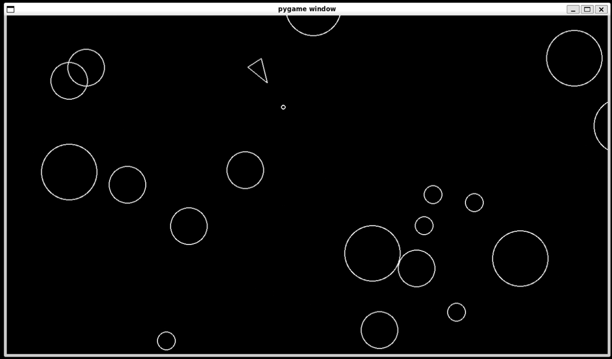

# Py-Asteroids-Game

A simple, classic asteroids game built with Python. Navigate your spaceship through space, avoiding and destroying asteroids to survive as long as possible.



## Features

- Classic arcade-style gameplay
- Keyboard controls for navigation and shooting

## How to Play

1. Clone the repository:
    ```bash
    git clone https://github.com/Vardhu2706/py-asteroids-game.git
    ```
2. Navigate to the project directory:
    ```bash
    cd py-asteroids-game
    ```
3. Run the game:
    ```bash
    python main.py
    ```

## Requirements

- Python 3.x
- Pygame
